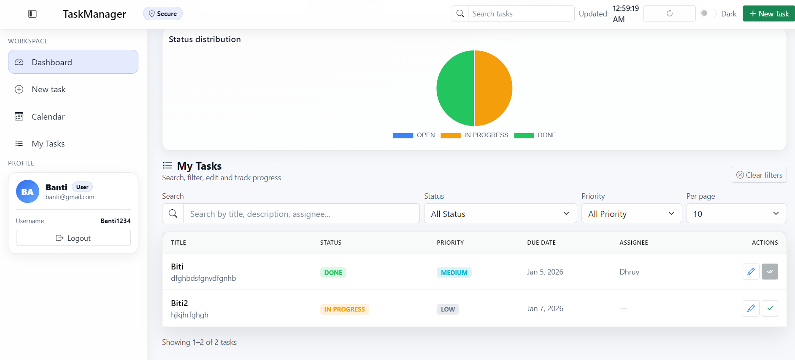
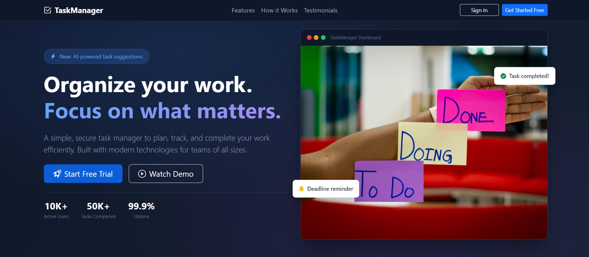

# Task Manager — Spring Boot + MongoDB + JWT

A modern task manager with a clean web UI (Thymeleaf + Bootstrap), JWT authentication (login/signup), role-based access control, analytics dashboard, and optional webhook integration.

---

### Landing Page


### Dashboard



## Table of Contents
- [Features](#features)
- [Tech Stack](#tech-stack)
- [Screenshots (optional)](#screenshots-optional)
- [Quick Start (Development)](#quick-start-development)
- [Configuration](#configuration)
- [Default Admin User](#default-admin-user)
- [API](#api)
- [Project Layout](#project-layout)
- [Build & Test](#build--test)
- [License](#license)

---

## Features
- Authentication: Sign up / Login with JWT
- Role-based access: User vs Admin
- Task management: create, list, update, delete (policy-based)
- Analytics dashboard:
  - Status and priority charts
  - Completion trend
  - Admin-level analytics (team view)
- Optional webhook publisher for task events (disabled by default)

Backend entry point: [`com.dhruv.taskmanager.TaskmanagerApplication`](src/main/java/com/dhruv/taskmanager/TaskmanagerApplication.java)  
Ping endpoint: [`com.dhruv.taskmanager.controller.PingController`](src/main/java/com/dhruv/taskmanager/controller/PingController.java)  
UI routes: [`com.dhruv.taskmanager.controller.ViewController`](src/main/java/com/dhruv/taskmanager/controller/ViewController.java)

---

## Tech Stack
| Layer | Tech |
|------|------|
| Runtime | Java 21 |
| Framework | Spring Boot 3 |
| Database | MongoDB |
| Security | Spring Security + JWT |
| UI | Thymeleaf + Bootstrap 5 |
| Charts | Chart.js (dashboard) |

---

<!-- ## Screenshots (optional)
You can include screenshots in the README (recommended). Add images under `docs/images/` and uncomment the section below. -->


**How to add screenshots**
1. Create folder: `docs/images/`
2. Save images as:
   - `docs/images/landing.png`
   - `docs/images/dashboard.png`
3. Uncomment the Markdown section above.

---

## Quick Start (Development)

### Prerequisites
- JDK 21
- MongoDB (local or Atlas connection string)
- Maven wrapper (included): `mvnw` / `mvnw.cmd`

### Run
Windows (PowerShell):
```powershell
$env:MONGODB_URI="mongodb://localhost:27017/taskmanager"
$env:APP_JWT_SECRET="change-me-to-a-long-secret"
$env:APP_JWT_EXP_MIN="120"
# optional:
# $env:APP_WEBHOOK_URL="https://example.com/webhook"

.\mvnw clean spring-boot:run
```

Linux/macOS:
```sh
export MONGODB_URI="mongodb://localhost:27017/taskmanager"
export APP_JWT_SECRET="change-me-to-a-long-secret"
export APP_JWT_EXP_MIN=120
# optional:
# export APP_WEBHOOK_URL="https://example.com/webhook"

./mvnw clean spring-boot:run
```

Open:
- Landing page: http://localhost:8080
- Health check: http://localhost:8080/ping
- Dashboard UI: http://localhost:8080/dashboard

---

## Configuration
All configuration is in [src/main/resources/application.properties](src/main/resources/application.properties).

| Property | Env var | Default | Notes |
|---------|---------|---------|------|
| `spring.data.mongodb.uri` | `MONGODB_URI` | `mongodb://localhost:27017/taskmanager` | MongoDB connection |
| `app.jwt.secret` | `APP_JWT_SECRET` | `change-me-to-a-long-secret` | Change in production |
| `app.jwt.exp-min` | `APP_JWT_EXP_MIN` | `120` | Token expiration in minutes |
| `app.webhook.url` | `APP_WEBHOOK_URL` | *(empty)* | Empty disables webhook |

**Webhook behavior**
- `app.webhook.url` is intentionally empty by default so the app runs without any external dependency.
- When set, the webhook publisher posts task events to your URL.

---

## Default Admin User
On first run, an admin user is seeded by [`com.dhruv.taskmanager.TaskmanagerApplication`](src/main/java/com/dhruv/taskmanager/TaskmanagerApplication.java):

- username: `admin`
- password: `admin123`

Change/remove this seed logic for production deployments.

---

## API

### Auth
```http
POST /auth/signup
Body: { "username": "...", "password": "..." }
→ { "token": "<JWT>", "roles": ["USER"], "user": { ... } }

POST /auth/login
Body: { "username": "...", "password": "..." }
→ { "token": "<JWT>", "roles": ["USER"|"ADMIN"], "user": { ... } }
```

### Tasks (Authorization: `Bearer <token>`)
```http
GET    /api/tasks
GET    /api/tasks/{id}
POST   /api/tasks
PUT    /api/tasks/{id}
DELETE /api/tasks/{id}        // admin only by policy
```

Example cURL:
```sh
TOKEN=$(curl -s -X POST localhost:8080/auth/login \
  -H "Content-Type: application/json" \
  -d '{"username":"admin","password":"admin123"}' | jq -r .token)

curl -H "Authorization: Bearer $TOKEN" localhost:8080/api/tasks
```

---

## Project Layout
- Backend source: [src/main/java](src/main/java)
- Templates (Thymeleaf): [src/main/resources/templates](src/main/resources/templates)
- Static assets: [src/main/resources/static](src/main/resources/static)
- Config: [pom.xml](pom.xml), [src/main/resources/application.properties](src/main/resources/application.properties)

Key UI files:
- Landing: [src/main/resources/templates/index.html](src/main/resources/templates/index.html)
- Login: [src/main/resources/templates/login.html](src/main/resources/templates/login.html)
- Signup: [src/main/resources/templates/signup.html](src/main/resources/templates/signup.html)
- Dashboard: [src/main/resources/templates/dashboard.html](src/main/resources/templates/dashboard.html)
- Dashboard JS: [src/main/resources/static/dashboard.js](src/main/resources/static/dashboard.js)
- Global styles: [src/main/resources/static/main.css](src/main/resources/static/main.css)

Analytics DTOs: [`com.dhruv.taskmanager.dto.AnalyticsDtos`](src/main/java/com/dhruv/taskmanager/dto/AnalyticsDtos.java)

---

## Build & Test
```sh
./mvnw -DskipTests compile
./mvnw test
./mvnw package
```

---

## License
MIT  [LICENSE](LICENSE).
